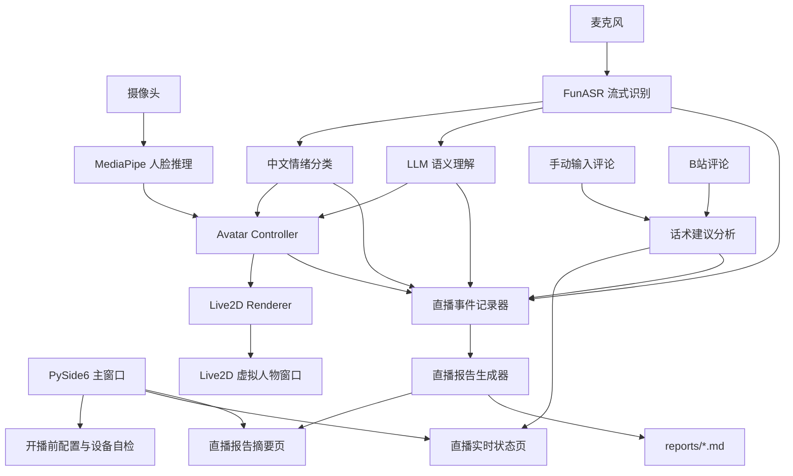

# Virtual Avatar Intelligent Driving System

基于 Python 的 Live2D 多模态虚拟形象智能驱动系统。项目面向 Windows 桌面直播场景，目标是把摄像头、麦克风、FunASR 语音识别、情绪识别、LLM 语义理解、观众评论分析、话术建议和 Live2D 虚拟人物驱动整合到一个可演示、可审查、可扩展的直播辅助系统中。

系统不是单纯把几个模型连接起来，而是围绕“虚拟主播直播辅助”这一业务场景，提供开播前设备自检、直播中实时状态观察、观众评论输入与 B站评论接入、话术建议、虚拟人物动作/表情驱动、直播结束报告沉淀等完整流程。

## 项目解决的问题

传统虚拟形象演示通常只展示人物模型播放动作，缺少明确业务场景，也很难证明系统在直播过程中真正理解了观众互动。本项目把虚拟形象驱动放到直播业务中，重点解决以下问题：

- 开播前不知道摄像头、麦克风和 LLM 是否可用，容易在演示时才暴露问题。
- 直播过程中系统是否正在识别语音、检测情绪、理解语义不够直观。
- 观众评论进入后，主播缺少即时话术建议。
- 虚拟人物动作、表情和业务语义之间缺少统一驱动链路。
- 直播结束后没有数据沉淀，老师难以判断系统产生了哪些业务价值。

因此，本项目形成了“开播前检查 -> 直播中辅助 -> 直播后报告”的完整闭环。

## 项目定位

本项目面向虚拟主播、课程展示、产品讲解和直播互动演示场景。

主播在直播过程中通常需要同时关注摄像头、麦克风、观众评论、讲解内容和虚拟人物表现。系统通过多模态感知和业务面板，把底层模型能力转化为可见的直播辅助能力：

- 主播说话后，系统识别语音文本、分析情绪和语义。
- 观众评论进入系统后，系统分析评论意图并给出推荐回复。
- 语义和情绪结果驱动 Live2D 人物动作与表情。
- 停止直播后，系统生成本场直播摘要和 Markdown 报告，沉淀互动数据。

## 功能总览

| 功能模块 | 已实现能力 | 对应业务价值 |
| --- | --- | --- |
| 开播前自检 | 摄像头测试、麦克风测试、LLM 连接测试 | 降低开播失败风险，方便演示前确认环境 |
| 实时状态面板 | 展示设备连接、人脸检测、ASR、语义、情绪、动作 | 让系统工作过程可视化，便于老师审查 |
| 观众评论输入 | 支持手动输入评论并分析 | 无真实直播环境时也能演示互动业务 |
| B站自动输入 | 支持连接 B站直播间并接收评论 | 证明系统可以接入真实平台互动数据 |
| 话术建议 | 根据评论生成推荐回复和讲解重点 | 帮助主播快速回应观众，提高互动效率 |
| Live2D 驱动 | 根据视觉、情绪和语义驱动人物动作/表情 | 让虚拟人物不只是展示模型，而是响应直播状态 |
| 后台输出 | 展示运行日志、连接状态和异常信息 | 方便调试，也方便老师看到后端链路 |
| 直播报告 | 停播后生成摘要页和 Markdown 报告 | 沉淀 ASR、评论、语义、情绪、动作等业务数据 |

## 核心功能

### 1. 开播前配置与自检

开播前主窗口提供三类配置：

- 设备配置：摄像头、麦克风、分辨率、帧率、采样率。
- 人物模型配置：Live2D `.model3.json` 模型路径。
- LLM 模型配置：API 地址、API Key、模型名称。

为了避免开播后才发现设备不可用，配置页提供连接测试：

- 摄像头连接测试：打开当前摄像头并读取一帧画面。
- 麦克风连接测试：打开当前麦克风并采样一小段音频。
- LLM 连接测试：向 OpenAI 兼容接口发送一次短请求，验证地址、密钥和模型名称是否可用。

LLM 配置会自动写入项目根目录 `.env`，真实 API Key 不写入 `configs/app_config.json`，避免误提交密钥。

### 2. 开始直播加载流程

点击“开始直播”后，主窗口先切换到加载页，显示阶段提示：

- 创建摄像头采集器
- 加载 Live2D 模型
- 渲染人物第一帧
- 打开摄像头
- 启动 MediaPipe 人脸推理
- 启动麦克风、FunASR、情绪分类和 LLM 链路

Live2D 人物第一帧渲染完成后，再切换到直播运行页，减少“点击开始后主窗口长时间无反馈”的问题。

### 3. 直播实时状态面板

直播运行页采用左侧导航、右侧内容区结构，包含：

- 实时状态
- 话术建议
- 后台输出

实时状态页展示：

- 摄像头连接状态
- 人脸检测状态
- 麦克风连接状态
- 监听状态
- FunASR 文本识别
- LLM 语义标签
- 情绪结果
- 当前动作

这让老师或演示者可以直观看到系统正在工作，而不是只看到一个 Live2D 人物窗口。

### 4. 话术建议面板

话术建议面板分为两种输入模式：

- 手动输入
- 自动输入

手动输入用于课堂演示和无真实直播平台时的测试。输入观众评论后点击“分析评论”，系统会给出：

- 当前观众评论
- 当前推荐回复
- 推荐讲解重点
- LLM 语义标签或规则语义标签

自动输入用于接入 B站直播评论。输入 B站直播间号并连接后，系统会接收直播间评论，并自动刷新话术建议。

示例：

```text
观众评论：这个适合学生用吗？
语义标签：用户提问 / 使用场景
推荐回复：适合学生使用，主要优势是操作简单、学习成本低，可用于课程展示和直播讲解。
推荐讲解重点：学生使用场景、操作简单、学习成本低、课程展示、直播讲解
```

当前版本中，主播语音链路会调用 LLM 做语义理解；观众评论话术建议采用最小可用规则分析，后续可替换为真实 LLM 评论分析。

### 5. B站评论接入

系统提供 B站直播评论最小可用接入能力：

- 输入直播间号
- 连接 B站评论服务
- 接收 WebSocket 弹幕消息
- 轮询历史评论作为兜底
- 对收到的评论自动触发话术建议

该能力用于证明系统可以从真实直播平台获取互动数据。真实生产级平台接入还需要进一步处理登录态、风控、断线重连策略和平台协议变化。

### 6. Live2D 虚拟人物驱动

Live2D 渲染层以独立进程运行，避免阻塞 PySide6 主窗口。

当前支持：

- Live2D 模型加载
- 透明背景窗口
- 紧凑人物窗口尺寸
- 窗口置顶
- 表情播放
- 动作播放
- 第一帧渲染完成通知

渲染层只负责显示和播放，不直接处理业务逻辑。所有状态融合统一由 `AvatarController` 管理。

### 7. 直播结束报告

停止直播后，系统会先展示本次直播报告摘要页，然后用户点击“返回主页”回到开播前配置页。

摘要页展示：

- 报告存放位置
- 直播时间与时长
- 系统工作记录数
- FunASR 文本条数
- 观众评论数量
- 推荐改进点
- LLM 语义标签分布
- 情绪结果分布
- 当前动作分布
- 高频评论

系统同时在 `reports/` 目录生成 Markdown 直播报告，记录：

- 基本信息
- 语义标签分布
- 情绪结果分布
- 动作分布
- 高频评论
- 关键事件明细
- 推荐改进点

这部分用于体现业务数据沉淀能力，而不是只停留在实时模型连接。

报告中的关键指标含义如下：

| 指标 | 记录内容 | 说明 |
| --- | --- | --- |
| 系统工作记录数 | ASR、评论、语义、情绪、动作等事件总数 | 用于判断直播过程中系统是否持续产生有效工作记录 |
| FunASR 文本条数 | 主播麦克风识别出的语音文本数量 | 用于判断语音识别链路是否工作 |
| 观众评论数量 | 手动输入或 B站自动接入的观众评论数量 | 用于判断直播互动数据是否进入系统 |
| LLM 语义标签分布 | 语义标签出现次数 | 用于观察观众或主播内容主要集中在哪些业务类型 |
| 情绪结果分布 | 情绪识别结果出现次数 | 用于观察直播中的情绪变化 |
| 当前动作分布 | Live2D 动作标签出现次数 | 用于判断语义和状态是否驱动了人物动作 |
| 高频评论 | 重复出现较多的观众评论 | 用于提炼观众高关注问题或高频互动内容 |

这套报告可以帮助老师看到：系统不仅能实时运行，还能把直播过程中的交互和模型输出沉淀成可复盘的数据。

## 当前完成情况

| 能力 | 状态 | 说明 |
| --- | --- | --- |
| 桌面主窗口 | 已完成 | 提供配置页、运行页、报告页和统一状态切换 |
| 开播前设备测试 | 已完成 | 支持摄像头、麦克风和 LLM 连接测试 |
| 摄像头视觉链路 | 已完成 | 支持摄像头采集、MediaPipe 人脸检测和状态展示 |
| 麦克风语音链路 | 已完成 | 支持麦克风采集和 FunASR 流式识别 |
| 情绪识别 | 已完成 | 支持基于文本的中文情绪识别和表情映射 |
| LLM 语义理解 | 已完成最小可用版 | 主播语音链路可调用 LLM 生成语义结果并映射动作 |
| 观众评论话术建议 | 已完成最小可用版 | 支持手动评论和 B站评论输入，当前以规则分析生成建议 |
| B站评论接入 | 已完成演示版 | 支持直播间连接、弹幕接收和历史评论轮询兜底 |
| Live2D 渲染 | 已完成 | 支持独立透明窗口、紧凑尺寸、表情和动作播放 |
| 直播报告 | 已完成 | 停播后生成摘要页和 Markdown 报告 |

后续可以继续扩展真实 LLM 评论分析、多平台评论接入、更多业务标签、报告可视化图表和自动化测试。

## 技术栈

| 模块 | 技术 |
| --- | --- |
| 桌面界面 | PySide6 / Qt |
| Live2D 渲染 | live2d-py / pygame / PyOpenGL |
| 摄像头采集 | OpenCV |
| 人脸推理 | MediaPipe |
| 麦克风采集 | sounddevice |
| 语音识别 | FunASR |
| 情绪分类 | Transformers / PyTorch |
| LLM 语义理解 | langchain-openai / OpenAI-compatible API |
| B站评论接入 | WebSocket / B站直播接口 |
| 报告生成 | Python Markdown 文本生成 |
| 环境管理 | uv |

## 系统架构



核心数据流遵循单向原则：

```text
Camera / Mic / LLM / Emotion / Comments
        |
        v
Avatar Controller / Business Advisor
        |
        v
Live2D Renderer / Report Generator
```

## 目录结构

```text
.
├── main.py
├── pyproject.toml
├── uv.lock
├── configs/
│   ├── app_config.json
│   ├── emotion_maps.json
│   └── motion_maps.json
├── src/virtual_avatar_system/
│   ├── audio/            # 麦克风采集、FunASR、语音理解服务
│   ├── business/         # 观众评论分析与话术建议
│   ├── comments/         # B站评论接入
│   ├── config/           # 配置加载、保存、.env 写入
│   ├── controller/       # 多模态状态融合
│   ├── emotion/          # 情绪分类
│   ├── llm/              # LLM 语义理解
│   ├── renderer/         # Live2D 独立渲染进程
│   ├── reporting/        # 直播事件记录与报告生成
│   ├── ui/               # PySide6 主窗口与页面
│   ├── utils/            # 运行时依赖辅助
│   └── vision/           # 摄像头采集与人脸推理
├── scripts/poc/          # 单模块验证脚本
├── docs/                 # 项目计划文档
└── reports/              # 本地生成的直播报告，不建议提交
```

## 关键模块说明

### UI 层

位置：`src/virtual_avatar_system/ui/`

- `main_window.py`：主窗口、页面切换、状态机联动。
- `settings_page.py`：开播前配置页，包含摄像头、麦克风和 LLM 连接测试。
- `live_dashboard_page.py`：直播实时状态页、话术建议面板、B站评论入口。
- `live_report_summary_page.py`：停止直播后的报告摘要页。
- `log_panel.py`：后端日志输出面板。
- `live_state_machine.py`：直播状态机。

### 视觉链路

位置：`src/virtual_avatar_system/vision/`

- `camera_source.py`：摄像头采集线程。
- `face_inference.py`：MediaPipe 人脸推理。
- `feature_packet.py`：视觉特征数据结构。

视觉链路输出人脸检测状态、头部姿态、眼睛开合、嘴部开合等信息，供虚拟人物基础驱动使用。

### 语音与理解链路

位置：`src/virtual_avatar_system/audio/`

- `source.py`：麦克风采集。
- `funasr_streaming.py`：FunASR 流式识别封装。
- `sentence_accumulator.py`：自然句累积。
- `live_speech_service.py`：语音、情绪和 LLM 后台服务整合。

语音链路运行在后台线程中，避免阻塞 UI。LLM 调用使用最小间隔控制，避免高频调用。

### 业务能力层

位置：`src/virtual_avatar_system/business/`

- `comment_advisor.py`：观众评论分析和话术建议生成。

当前版本为最小可用规则分析，能够覆盖使用场景、价格咨询、感谢、告别、欢迎等常见直播评论类型。

### 评论接入层

位置：`src/virtual_avatar_system/comments/`

- `bilibili_comment_source.py`：B站直播评论接入。

支持 WebSocket 弹幕接收，并增加历史评论轮询兜底，降低只连接成功但收不到评论的演示风险。

### 报告模块

位置：`src/virtual_avatar_system/reporting/`

- `live_event_recorder.py`：直播过程事件记录。
- `live_report_generator.py`：直播结束报告生成。

记录类型包括 ASR 文本、情绪变化、语义标签、动作变化和观众评论。

### Avatar Controller

位置：`src/virtual_avatar_system/controller/avatar_controller.py`

负责融合视觉、情绪和语义输入，生成统一的 `AvatarOutputState`。Live2D 渲染层只消费该输出，不直接读取摄像头、麦克风或业务状态。

### Live2D Renderer

位置：`src/virtual_avatar_system/renderer/live2d_renderer.py`

负责 Live2D 模型加载、透明窗口、参数更新、表情播放和动作播放。渲染进程与主 UI 分离，提高稳定性。

## 环境要求

- 操作系统：Windows 10 / Windows 11
- Python：`>=3.12,<3.13`
- 包管理工具：uv
- 摄像头：用于视觉驱动和人脸检测
- 麦克风：用于 FunASR 语音识别
- LLM API：兼容 OpenAI 接口格式

Live2D 透明窗口依赖 Windows 桌面环境和 OpenGL 渲染能力，因此当前主要面向 Windows。

## 快速开始

### 1. 同步依赖

```bash
uv sync
```

### 2. 准备 LLM 配置

可以在主窗口中填写，也可以手动创建 `.env`：

```env
LLM_BASE_URL=https://api.openai.com/v1
LLM_API_KEY=sk-your-api-key-here
LLM_MODEL=gpt-4o-mini
```

项目会把 API Key 写入 `.env`，不写入 `configs/app_config.json`。

### 3. 准备模型资源

仓库不提交大体积模型资源和密钥。请确保以下资源存在，或在界面中改为实际路径：

```text
models/haru_ja/runtime/haru.model3.json
models/hf_cache/Johnson8187__Chinese-Emotion-Small
scripts/poc/assets/face_landmarker.task
```

说明：

- `models/` 目录适合放置本地 Live2D 模型和情绪模型缓存。
- FunASR 模型可能会在首次运行时自动下载到本机缓存目录。
- MediaPipe 人脸模型文件用于人脸关键点推理。

### 4. 运行项目

```bash
uv run python main.py
```

如果依赖已经同步，可以使用：

```bash
uv run --no-sync python main.py
```

## 推荐演示流程

1. 打开项目主窗口。
2. 在“设备配置”中测试摄像头和麦克风。
3. 在“LLM 模型配置”中填写 API 地址、API Key 和模型名称，并点击测试 LLM。
4. 点击“开始直播”。
5. 观察 Live2D 人物窗口出现。
6. 在“实时状态”页查看摄像头、麦克风、ASR、语义、情绪和动作状态。
7. 切换到“话术建议”页。
8. 使用“手动输入”输入观众评论并分析。
9. 或使用“自动输入”连接 B站直播间评论。
10. 点击“停止直播”。
11. 查看直播报告摘要和 `reports/*.md` 报告文件。

## 配置文件说明

### `configs/app_config.json`

保存应用基础配置，包括摄像头编号、麦克风编号、Live2D 模型路径、窗口尺寸、ASR 参数和 LLM 调用间隔等。

真实 `llm_api_key` 不保存到该文件，避免密钥进入仓库。

### `configs/emotion_maps.json`

定义情绪标签到 Live2D 表情 ID 的映射。

### `configs/motion_maps.json`

定义语义描述到 Live2D 动作组和动作索引的映射。LLM 输出语义描述后，系统通过该文件找到具体动作。

## 独立验证脚本

`scripts/poc/` 中提供单模块验证脚本：

```bash
uv run python scripts/poc/mediapipe_validation.py
uv run python scripts/poc/funasr_streaming_validation.py
uv run python scripts/poc/hf_emotion_checkpoint_test.py
uv run python scripts/poc/llm_validation.py
uv run python scripts/poc/live2d_poc.py
```

这些脚本用于分别检查摄像头、ASR、情绪模型、LLM 和 Live2D 渲染是否可用。

## 常见问题

### LLM 配置不完整

请检查：

- API 地址是否填写，例如 `https://api.openai.com/v1`
- API Key 是否填写
- 模型名称是否填写
- 是否点击过 LLM 连接测试

### 摄像头或麦克风测试失败

请检查：

- 设备是否被其他软件占用
- Windows 隐私权限是否允许访问摄像头和麦克风
- 下拉框选择的设备是否正确
- 麦克风采样率是否被设备支持

### B站显示已连接但没有评论

可能原因：

- 当前直播间没有新评论
- 平台 WebSocket 没有推送弹幕
- 网络或平台协议有变化

系统已增加历史评论轮询兜底，通常可以降低演示时“连接成功但无评论”的风险。

### Live2D 人物没有出现

请检查：

- Live2D 模型路径是否存在
- `.model3.json` 文件是否正确
- OpenGL 环境是否可用
- 日志中是否出现模型加载错误

## 当前实现边界

- 当前主要支持 Windows。
- Live2D 人物窗口是独立渲染窗口，不是嵌入 PySide6 主窗口的控件。
- 主播语音链路会调用 LLM 做语义理解。
- 观众评论话术建议当前为最小可用规则分析，后续可升级为真实 LLM 评论分析。
- B站评论接入为教学演示级能力，生产环境需要更完整的断线重连、登录态和协议兼容策略。
- 模型资源和 API Key 不随仓库提交，需要本地准备。

## 项目亮点总结

- 不是单一模型演示，而是完整直播辅助流程。
- 具备开播前自检，降低演示和使用风险。
- 具备实时状态面板，让系统工作过程可视化。
- 具备观众评论输入与 B站评论接入，体现真实业务互动入口。
- 具备话术建议能力，面向主播实际工作场景。
- 具备直播结束报告，体现业务数据沉淀。
- 采用模块化设计，后续可以继续替换模型、接入更多平台或升级 LLM 评论分析。

## 老师审查建议

建议重点查看：

1. `main.py`：应用启动、开播和停播链路编排。
2. `src/virtual_avatar_system/ui/settings_page.py`：开播前配置和连接测试。
3. `src/virtual_avatar_system/ui/live_dashboard_page.py`：实时状态、话术建议和 B站评论入口。
4. `src/virtual_avatar_system/business/comment_advisor.py`：观众评论分析与推荐回复。
5. `src/virtual_avatar_system/reporting/live_report_generator.py`：直播报告生成。
6. `src/virtual_avatar_system/controller/avatar_controller.py`：多模态状态融合。
7. `src/virtual_avatar_system/renderer/live2d_renderer.py`：Live2D 独立渲染。
