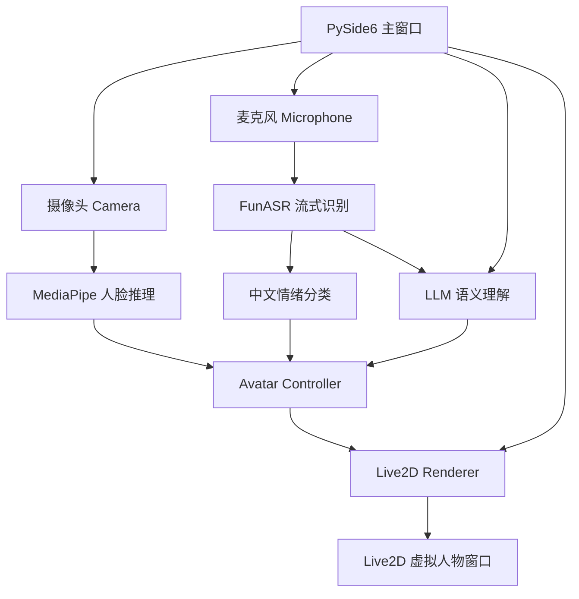

# Virtual Avatar Intelligent Driving System

基于 Python 的 Live2D 多模态虚拟形象驱动系统。项目面向 Windows 桌面端，目标是把摄像头、人脸姿态、麦克风、实时语音识别、情绪识别、LLM 语义理解和 Live2D 虚拟形象统一到一个可运行的直播辅助系统中。

系统启动后，用户可以在主窗口完成摄像头、麦克风、Live2D 模型和 LLM 参数配置；点击“开始直播”后，程序会启动视觉、语音、情绪、语义和渲染链路，并通过 Live2D 窗口实时驱动虚拟人物动作、表情和基础姿态。

## 项目特色

- **多模态输入**：摄像头采集人脸姿态，麦克风采集语音。
- **实时语音识别**：使用 FunASR 流式识别中文语音。
- **情绪理解**：对 ASR 累积文本做中文情绪分类，并映射到 Live2D 表情。
- **LLM 语义理解**：在自然句结束后低频调用兼容 OpenAI 接口的 LLM，将语义映射为动作标签。
- **Live2D 驱动**：通过独立渲染进程显示 Live2D 人物，支持透明背景、紧凑窗口、置顶显示、表情和动作播放。
- **桌面 GUI**：使用 PySide6 构建主窗口，包含开播前配置页、启动/停止加载页、直播运行状态页和后端日志面板。
- **模块化架构**：感知、理解、控制、渲染和 UI 分层实现，降低模块耦合。

## 技术栈

| 模块 | 技术 |
| --- | --- |
| 桌面界面 | PySide6 / Qt |
| Live2D 渲染 | live2d-py / pygame / PyOpenGL / Windows DWM |
| 摄像头与图像处理 | OpenCV / MediaPipe |
| 麦克风采集 | sounddevice |
| 语音识别 | FunASR |
| 情绪分类 | Transformers / PyTorch |
| LLM 语义理解 | langchain-openai / OpenAI-compatible API |
| 环境与依赖管理 | uv |

## 系统架构



核心原则是单向数据流：

```text
Camera / Mic / LLM / Emotion
        |
        v
Avatar Controller
        |
        v
Live2D Renderer
```

Live2D 渲染层只负责模型加载、参数更新、表情播放和动作播放；业务状态统一由 `AvatarController` 管理。

## 目录结构

```text
.
├── main.py                                  # 应用入口，连接 UI、视觉、语音、LLM 与渲染链路
├── pyproject.toml                           # uv 项目依赖配置
├── uv.lock                                  # uv 锁文件
├── configs/
│   ├── app_config.json                      # 应用运行配置
│   ├── emotion_maps.json                    # 情绪到 Live2D 表情映射
│   └── motion_maps.json                     # LLM 语义描述到 Live2D 动作映射
├── src/virtual_avatar_system/
│   ├── audio/                               # 麦克风采集、FunASR、句子累积、语音理解服务
│   ├── config/                              # 配置加载、保存、路径解析、.env 写入
│   ├── controller/                          # 多模态状态融合和 Live2D 输出状态生成
│   ├── emotion/                             # 中文情绪分类与表情映射
│   ├── llm/                                 # LLM 语义理解和动作标签匹配
│   ├── renderer/                            # Live2D 独立渲染进程
│   ├── ui/                                  # PySide6 主窗口、设置页、直播状态页、日志面板
│   ├── utils/                               # 运行时依赖辅助
│   └── vision/                              # 摄像头采集、MediaPipe 人脸推理、视觉特征包
├── scripts/poc/                             # 各模块独立验证脚本
└── docs/                                    # 开发计划与说明文档
```

## 主要功能说明

### 1. 开播前配置

主窗口启动后默认显示配置页，支持设置：

- 摄像头编号、分辨率、帧率
- 麦克风设备、采样率、音频块大小
- Live2D 模型 `.model3.json` 路径
- LLM API 地址、API Key、模型名称

LLM 配置会写入项目根目录 `.env`，避免把密钥保存到 `configs/app_config.json` 或提交到仓库。

### 2. 启动直播流程

点击“开始直播”后，主窗口会切换到紧凑加载页，分阶段显示：

- 创建摄像头采集器
- 加载 Live2D 模型
- 渲染人物第一帧
- 打开摄像头
- 启动 MediaPipe 人脸推理
- 启动麦克风、FunASR、情绪分类和 LLM 链路

Live2D 渲染进程完成第一帧后，主窗口再切换到直播运行状态页，减少“点击后无响应”的体验问题。

### 3. 直播运行状态页

直播中主窗口显示：

- 启动阶段
- 摄像头状态
- 麦克风状态
- ASR 文本
- 语义标签
- 情绪结果
- 当前动作
- 后端日志输出

后端日志面板会显示 ASR、情绪分类、LLM 调用、设备启动和异常信息，便于演示和调试。

### 4. 停止直播流程

点击“停止直播”后，主窗口会切换到停止加载页，显示资源释放进度：

- 关闭麦克风和语音识别
- 停止视觉桥接定时器
- 关闭人脸推理
- 关闭摄像头
- 关闭 Live2D 人物模型

释放完成后自动回到开播前配置页。

## 环境要求

- 操作系统：Windows 10 / Windows 11
- Python：`>=3.12,<3.13`
- 包管理：uv
- 摄像头：用于视觉驱动
- 麦克风：用于语音识别
- LLM API：兼容 OpenAI 接口格式

> 当前 Live2D 透明窗口实现依赖 Windows DWM 和 Win32 窗口句柄，因此主要面向 Windows 平台。

## 快速开始

### 1. 安装 uv

如果本机尚未安装 uv，请先参考 uv 官方安装方式安装。项目统一使用 uv 管理 Python 和依赖。

### 2. 同步依赖

```bash
uv sync
```

### 3. 准备 LLM 配置

复制 `.env.example` 为 `.env`，并填入实际 LLM 信息：

```bash
copy .env.example .env
```

`.env` 示例：

```env
LLM_BASE_URL=https://api.openai.com/v1
LLM_API_KEY=sk-your-api-key-here
LLM_MODEL=gpt-4o-mini
```

也可以在主窗口的“LLM 配置”卡片中填写，程序会自动创建或更新 `.env`。

### 4. 准备模型资源

仓库不提交大体积模型文件和密钥。请确保以下资源存在，或在界面中改为实际路径：

```text
models/haru_ja/runtime/haru.model3.json
models/hf_cache/Johnson8187__Chinese-Emotion-Small
scripts/poc/assets/face_landmarker.task
```

说明：

- `models/` 目录在 `.gitignore` 中，适合放置本地 Live2D 模型和情绪模型缓存。
- FunASR 模型可能会在首次运行时自动下载到本机缓存目录。
- MediaPipe 人脸模型文件用于人脸关键点推理。

### 5. 运行项目

```bash
uv run python main.py
```

如果依赖已经同步且不希望每次启动检查依赖，也可以使用：

```bash
uv run --no-sync python main.py
```

## 配置文件说明

### `configs/app_config.json`

保存应用基础配置，例如：

- 摄像头编号和分辨率
- 麦克风设备和采样率
- ASR 模型名称
- 情绪模型路径
- Live2D 模型路径
- Live2D 预览窗口尺寸和置顶开关
- LLM 调用最小间隔

其中 `llm_api_key` 默认不会保存真实密钥，密钥由 `.env` 管理。

### `configs/emotion_maps.json`

定义情绪标签到 Live2D 表情 ID 的映射，用于把中文情绪分类结果转换为虚拟人物表情。

### `configs/motion_maps.json`

定义语义描述到 Live2D 动作组和动作索引的映射。LLM 先从候选语义描述中选择最匹配项，系统再把描述映射为具体动作标签。

## 模块说明

### UI 层

位置：`src/virtual_avatar_system/ui/`

- `main_window.py`：主窗口、状态机联动、开播/停播按钮
- `settings_page.py`：开播前配置页
- `live_dashboard_page.py`：直播运行状态页
- `log_panel.py`：后端日志面板
- `live_state_machine.py`：直播状态机
- `system_tray.py`：系统托盘

### 视觉链路

位置：`src/virtual_avatar_system/vision/`

- `camera_source.py`：摄像头采集线程
- `face_inference.py`：MediaPipe 人脸推理
- `feature_packet.py`：视觉特征数据结构

输出的视觉特征包括头部姿态、眼睛开合、嘴部开合和身体姿态等。

### 语音与理解链路

位置：`src/virtual_avatar_system/audio/`

- `source.py`：麦克风采集
- `funasr_streaming.py`：FunASR 流式识别封装
- `sentence_accumulator.py`：自然句累积
- `live_speech_service.py`：语音、情绪、LLM 后台服务整合

语音链路在后台线程运行，避免阻塞 UI。

### 情绪模块

位置：`src/virtual_avatar_system/emotion/`

- 对 ASR 累积文本进行中文情绪分类
- 使用置信度阈值过滤低质量结果
- 将情绪标签映射为 Live2D 表情 ID

### LLM 语义模块

位置：`src/virtual_avatar_system/llm/`

- 在自然句结束后调用 LLM
- 从候选语义描述中选择最匹配项
- 映射到 Live2D 动作标签
- 使用最小调用间隔，避免高频调用 LLM

### Avatar Controller

位置：`src/virtual_avatar_system/controller/avatar_controller.py`

统一融合视觉、情绪和语义输入，输出 `AvatarOutputState` 给渲染层。渲染层不直接读取业务输入，只消费控制层输出。

### Live2D Renderer

位置：`src/virtual_avatar_system/renderer/live2d_renderer.py`

- 独立进程运行，避免渲染阻塞主 UI
- 使用 pygame + OpenGL 创建 Live2D 透明窗口
- 支持紧凑尺寸，减少透明区域遮挡
- 支持窗口置顶
- 第一帧渲染完成后通知主窗口切换到直播状态页

## 独立验证脚本

`scripts/poc/` 中提供了若干单模块验证脚本：

```bash
uv run python scripts/poc/mediapipe_validation.py
uv run python scripts/poc/funasr_streaming_validation.py
uv run python scripts/poc/hf_emotion_checkpoint_test.py
uv run python scripts/poc/llm_validation.py
uv run python scripts/poc/live2d_poc.py
```

这些脚本适合在集成调试前单独检查摄像头、ASR、情绪模型、LLM 和 Live2D 渲染是否可用。

## 常见问题

### 1. 启动后提示 LLM 配置不完整

请在主窗口 LLM 配置卡片中填写：

- API 地址
- API Key
- 模型名称

或手动创建 `.env` 文件并填写 `LLM_BASE_URL`、`LLM_API_KEY`、`LLM_MODEL`。

### 2. Live2D 人物没有出现

请检查：

- `configs/app_config.json` 中的 `model_paths` 是否指向真实 `.model3.json`
- `models/haru_ja/runtime/haru.model3.json` 是否存在
- 日志中是否出现 `Live2D 第一帧已渲染`
- 当前 Windows 是否允许创建透明 OpenGL 窗口

### 3. 摄像头或麦克风无法启动

请检查：

- 设备是否被其他程序占用
- 配置页中选择的设备编号是否正确
- Windows 隐私权限是否允许应用访问摄像头和麦克风

### 4. 首次运行较慢

首次运行可能会下载或加载 FunASR、情绪模型、MediaPipe 和 Live2D 资源。后续运行通常会更快。

## 当前实现边界

- 当前主要支持 Windows。
- Live2D 人物窗口是独立渲染窗口，不是嵌入 PySide6 主窗口的控件。
- LLM 调用依赖外部兼容 OpenAI 接口的服务。
- 模型资源和 API Key 不随仓库提交，需要本地准备。

## 项目审查建议

老师审查时可以重点查看：

1. `main.py`：整体应用启动和多链路编排。
2. `src/virtual_avatar_system/controller/avatar_controller.py`：多模态输入融合和 Live2D 输出状态。
3. `src/virtual_avatar_system/renderer/live2d_renderer.py`：Live2D 独立渲染进程和透明窗口。
4. `src/virtual_avatar_system/audio/live_speech_service.py`：语音、情绪和 LLM 后台服务。
5. `src/virtual_avatar_system/ui/main_window.py`：主窗口、状态切换、开播和停播体验。

## 版本状态

当前版本已经实现：

- 开播前配置页
- LLM 配置自动写入 `.env`
- 开播和停播加载页
- 直播实时状态页
- 后端日志输出面板
- 摄像头视觉驱动
- 麦克风语音识别
- 情绪到表情映射
- LLM 语义到动作映射
- Live2D 紧凑透明窗口渲染

后续可继续优化：

- 将 Live2D 渲染嵌入 Qt OpenGL 控件
- 增加设备热插拔检测
- 增加更完整的异常恢复策略
- 增加自动化测试和演示数据回放
