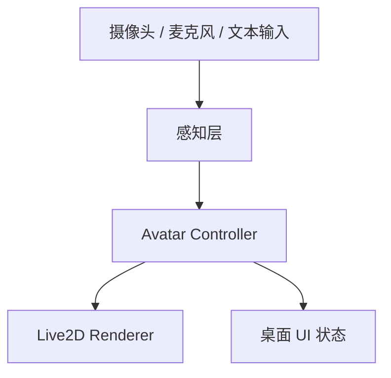

# Live2D 多模态虚拟形象驱动系统：四人正式开发分工计划

## 1. 目标

在完成技术预研与 POC 后，进入正式开发阶段，围绕 Windows 桌面端 MVP 构建一套可稳定运行的多模态虚拟形象驱动系统。

本阶段目标是把现有验证能力，收敛为可维护、可扩展、可交付的正式产品结构。

---

## 2. 总体分工原则

### 2.1 分层原则
系统必须保持单向数据流：



### 2.2 职责边界
- **桌面壳/UI**：只负责窗口、状态展示、配置与用户交互
- **视觉链路**：只负责摄像头、MediaPipe、动作特征提取
- **语音与语义链路**：只负责麦克风、FunASR、情绪、LLM 文本理解
- **融合与渲染**：只负责状态融合、优先级、Live2D 输出与稳定性

### 2.3 技术栈统一要求
- **语言**：Python 3.12+
- **依赖管理**：`uv` + `pyproject.toml`
- **UI**：`PySide6` 或 `Qt for Python`
- **摄像头**：`opencv-python`
- **视觉推理**：`mediapipe`
- **语音识别**：`funasr`
- **LLM**：`openai` 兼容接口 / `langchain-openai`
- **情绪分类**：Hugging Face `transformers`
- **渲染**：`live2d-py` / 当前已验证封装
- **并发**：`threading` / `asyncio` / 队列
- **配置**：`dataclass`（优先），`pydantic` 作为候选
- **日志**：`logging`

---

## 3. 四人分工总览

| 角色 | 负责模块 | 核心任务 |
|---|---|---|
| A | 桌面壳 / UI | 主窗口、设置页、小窗预览、系统托盘、配置持久化、状态机 |
| B | 视觉链路 | 摄像头采集、MediaPipe、动作特征、动作平滑与输出 |
| C | 语音 / 情绪 / LLM | 麦克风、FunASR、情绪分类、LLM 语义理解、低频语义输出 |
| D | Avatar Controller / 渲染 | 状态融合、优先级、Live2D 参数映射、渲染稳定性、联调 |

---

## 4. 详细分工

## A. 桌面壳 / UI 负责人

### 4.1 目标
搭建可操作的 Windows 桌面应用骨架，为多模态驱动提供稳定宿主。

### 4.2 具体任务
1. 主窗口、设置页、小窗预览页开发
2. 系统托盘、启动/退出/后台驻留流程
3. 直播状态机设计与 UI 表达
4. 摄像头、麦克风、渲染参数的设备选择界面
5. 配置持久化与恢复
6. 错误提示、权限提示、恢复按钮

### 4.3 技术栈
- `PySide6`
- `Qt`
- `dataclass`（优先）或 `pydantic` 配置模型
- `json` / `toml`
- `logging`

### 4.4 预留接口
#### UI -> Controller
```python
class AppUIEvents:
    def on_start_pressed(self) -> None: ...
    def on_stop_pressed(self) -> None: ...
    def on_device_changed(self, device_config: dict) -> None: ...
    def on_preview_toggle(self, visible: bool) -> None: ...
```

#### Controller -> UI
```python
class AppUIState:
    def update_status(self, status: str) -> None: ...
    def update_error(self, message: str) -> None: ...
    def update_device_list(self, devices: list[dict]) -> None: ...
```

### 4.5 阶段交付物
- 可运行桌面壳
- 状态机完整闭环
- 基础设置页
- 配置保存与恢复

---

## B. 视觉链路负责人

### 4.1 目标
建立稳定的摄像头输入与 MediaPipe 动作识别链路，为头像动作驱动提供高频输入。

### 4.2 具体任务
1. 摄像头采集线程或进程封装
2. MediaPipe 人脸关键点、头姿、眼睛、嘴部特征提取
3. 动作特征结构定义
4. 动作平滑、阈值过滤、节流与异常值剔除
5. 动作到标准特征的映射
6. 长时间运行稳定性测试

### 4.3 技术栈
- `opencv-python`
- `mediapipe`
- `numpy`
- `queue`
- `threading`

### 4.4 预留接口
#### 摄像头输入
```python
class CameraFrameSource:
    def start(self) -> None: ...
    def stop(self) -> None: ...
    def read(self) -> "FramePacket": ...
```

#### 视觉特征输出
```python
@dataclass
class VisualFeaturePacket:
    timestamp: float
    head_yaw: float
    head_pitch: float
    head_roll: float
    eye_open_left: float
    eye_open_right: float
    mouth_open: float
    face_detected: bool
```

#### 发送给融合层
```python
class VisualFeaturePublisher:
    def publish(self, packet: VisualFeaturePacket) -> None: ...
```

### 4.5 阶段交付物
- 摄像头采集模块
- MediaPipe 特征提取模块
- 视觉特征包定义
- 动作验证脚本
- 长时间稳定性报告

---

## C. 语音 / 情绪 / LLM 负责人

### 5.1 目标
构建低频但可靠的语音和语义输入链路，作为表情和慢变化状态的补充来源。

### 5.2 具体任务
1. 麦克风输入采集与缓存
2. FunASR 流式识别
3. 文本断句、稳定化、去噪
4. 情绪分类器接入
5. LLM 语义理解接入
6. 统一输出情绪标签、置信度、语义状态
7. 语音/情绪/语义联动验证

### 5.3 技术栈
- `sounddevice`
- `funasr`
- `torch`
- `torchaudio`
- `transformers`
- `openai` 或 `langchain-openai`
- `asyncio`
- `threading`

### 5.4 预留接口
#### 音频输入
```python
class AudioStreamSource:
    def start(self) -> None: ...
    def stop(self) -> None: ...
    def pull(self) -> "AudioChunk": ...
```

#### ASR 输出
```python
@dataclass
class AsrResult:
    text: str
    stable_text: str
    is_final: bool
    timestamp: float
```

#### 情绪输出
```python
@dataclass
class EmotionResult:
    label: str
    confidence: float
    source: str
```

#### LLM 输出
```python
@dataclass
class SemanticResult:
    label: str
    confidence: float
    summary: str
```

### 5.5 阶段交付物
- 麦克风采集模块
- FunASR 流式识别模块
- 情绪分类器接入
- LLM 语义验证脚本
- 统一语音/情绪结果格式

---

## D. Avatar Controller / 渲染负责人

### 6.1 目标
建立统一融合层，负责整合视觉、语音、情绪、语义输入，并输出到 Live2D。

### 6.2 具体任务
1. 统一状态对象设计
2. 优先级规则设计
3. 冷却时间、持续时间、过期机制设计
4. 状态冲突消解
5. 输出到 Live2D 的统一命令格式
6. 渲染层稳定性与恢复机制
7. 与各输入链路联调

### 6.3 技术栈
- `dataclasses`（优先），`pydantic` 作为候选
- `queue`
- `threading`
- `logging`
- `live2d-py` 或已验证封装

### 6.4 预留接口
#### 输入统一状态
```python
@dataclass
class AvatarInputState:
    visual: VisualFeaturePacket | None
    emotion: EmotionResult | None
    semantic: SemanticResult | None
    asr_text: str | None
    device_status: dict[str, str]
```

#### 融合输出
```python
@dataclass
class AvatarOutputState:
    expression: str
    motion_group: str
    motion_index: int
    parameter_overrides: dict[str, float]
```

#### Controller 核心接口
```python
class AvatarController:
    def ingest(self, state: AvatarInputState) -> None: ...
    def resolve(self) -> AvatarOutputState: ...
    def publish(self, output: AvatarOutputState) -> None: ...
```

#### 渲染层接口
```python
class Live2DRenderer:
    def load_model(self, model_path: str) -> None: ...
    def set_expression(self, expression_id: str) -> None: ...
    def play_motion(self, group: str, index: int) -> None: ...
    def update_parameters(self, params: dict[str, float]) -> None: ...
    def render_frame(self) -> None: ...
```

### 6.5 阶段交付物
- Avatar Controller 核心类
- 状态优先级与冲突消解规则
- Live2D 参数映射表
- 渲染接口封装
- 联调稳定版

---

## 5. 推荐协作方式

### 5.1 统一约定
1. 所有模块必须通过 Controller 交互
2. 所有输入必须有时间戳
3. 所有输出必须可追踪来源
4. 所有状态必须可回退
5. 所有关键逻辑必须有中文注释

### 5.2 目录建议
```text
src/
  virtual_avatar_system/
    ui/
    vision/
    audio/
    emotion/
    llm/
    controller/
    renderer/
    models/
    config/
    utils/
scripts/
  poc/
tests/
docs/
```

### 5.3 分支建议
- `main`：稳定发布分支
- `dev`：集成开发分支
- `feature/ui-*`
- `feature/vision-*`
- `feature/audio-*`
- `feature/controller-*`

---

## 6. 开发节奏建议

### 第 1 周
- A 完成桌面壳骨架
- B 完成视觉链路接口
- C 完成音频/情绪/LLM 接口封装
- D 完成 Controller 数据结构与渲染接口

### 第 2 周
- A 接配置与状态机
- B 接入 MediaPipe 稳定输出
- C 接入 FunASR 与情绪分类
- D 接 Live2D 输出和基础联调

### 第 3 周
- 全员联调
- 优先打通最小闭环：
  - 摄像头 -> 视觉特征 -> Controller -> Live2D
  - 麦克风 -> ASR -> 情绪/语义 -> Controller -> 表情
- 开始稳定性测试

### 第 4 周
- 长稳测试
- 异常恢复
- UI 完善
- 发布准备

---

## 7. 风险点与负责人

| 风险 | 负责人 | 应对方式 |
|---|---|---|
| Live2D 封装不稳定 | D | 封装隔离、预留替代接口 |
| 摄像头性能不足 | B | 降分辨率、降频率、线程隔离 |
| ASR 延迟过高 | C | 分段缓存、流式增量、异步处理 |
| 状态切换抖动 | D | 冷却、平滑、优先级控制 |
| UI 阻塞 | A | 后台线程、信号槽、非阻塞刷新 |

---

## 8. 验收标准

### 单模块验收
- 每个模块都能单独运行
- 每个模块都有独立验证脚本
- 每个模块都能输出结构化结果

### 联调验收
- 视觉、语音、情绪、语义能同时接入
- Controller 可稳定融合
- Live2D 可持续更新参数
- UI 不阻塞、不假死

### 发布验收
- 可连续运行
- 可恢复异常
- 可重复部署
- 可解释状态变化

---

## 9. 结论

四人分工的核心是：
- **A 负责可用的产品壳**
- **B 负责高频实时视觉输入**
- **C 负责语音、情绪、语义输入**
- **D 负责统一融合和 Live2D 输出**

这样可以保证各模块并行推进，同时保持接口清晰、职责单一、便于后续扩展。
